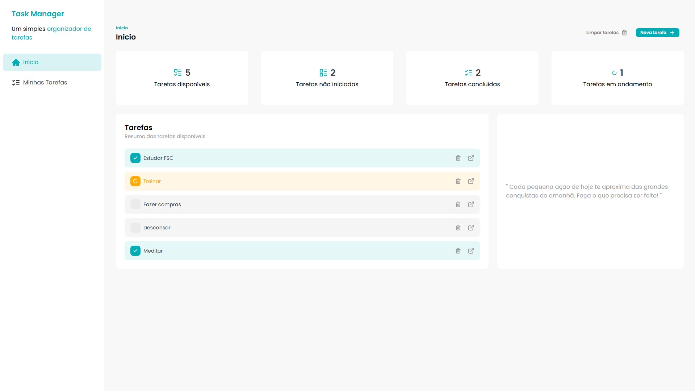
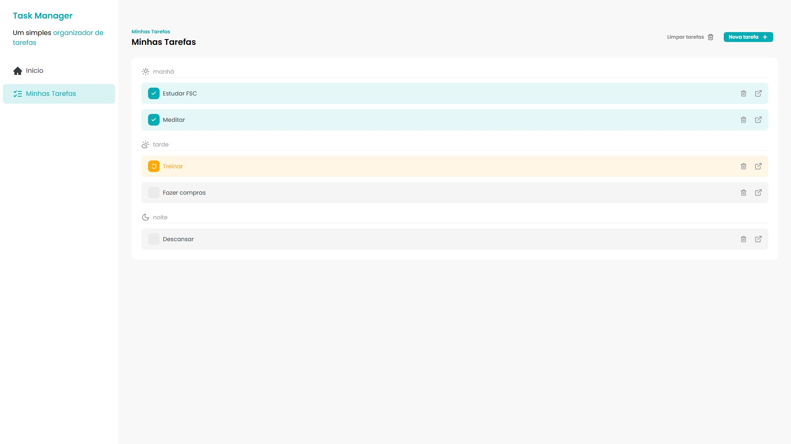
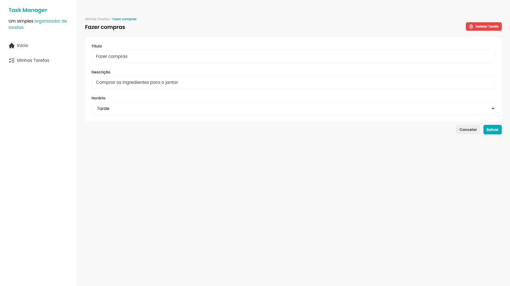

# Task Manager

Aplicação simples para gerenciamento de tarefas construída com React + Vite. Projeto criado como exercício/prática para demonstrar conceitos de SPA, componentes reutilizáveis, estilização com Tailwind e uso de back-end simulado via JSON-Server



## Tech Stack

- Front-End: React / Vite / Tailwind CSS
- Back-End: Node.js
- Banco: JSON Server

## Principais features

- Criar, editar e excluir tarefas
- Alterar status da tarefa (concluída, em andamento, não iniciada)
- Persistência local via arquivo db.json (JSON Server)





## Tecnologias

- React (Hooks, components, pages)
- Vite (bundler / dev server)
- Tailwind CSS (estilização)
- JSON Server (mock API com db.json)
- ESLint + Prettier (qualidade de formatação)
- Husky (ganchos de commit)

## Instalação local

- Clone o repositório e entre na pasta:

```code
git clone https://github.com/leopinheirosilva/task-manager.git
cd task-manager
```

- Instale as dependências

```code
npm install
```

- Rode a aplicação

```code
npm run dev
```

- Rode o JSON Server (inicia mock API com db.json)

```code
npm run json-server
```

## Deploy

- Vercel

clique [aqui](https://task-manager-eight-woad.vercel.app/) para acessar a aplicação!

## Contato

Email: <leonardopinheirosilva16@gmail.com>

LinkedIn: <https://www.linkedin.com/in/leonardo-pinheiro-13ba26281/>
